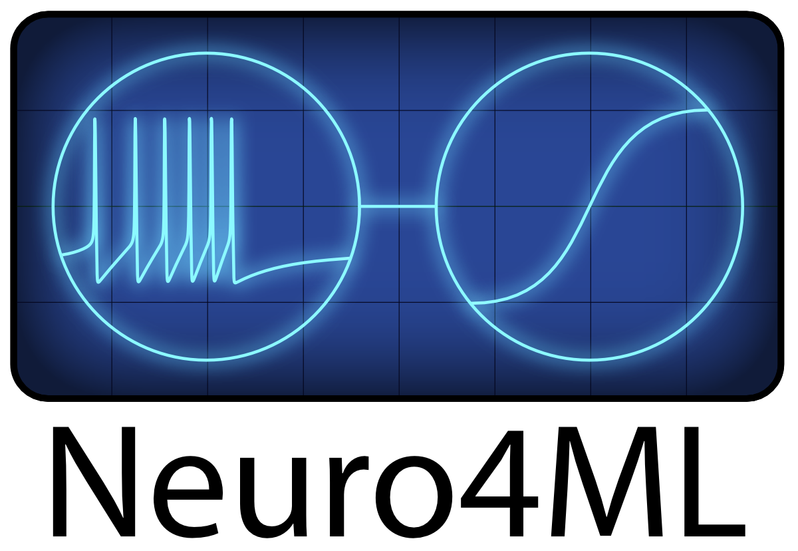

This is a freely available online course on neuroscience for people with a machine learning background.
The aim is to bring together these two fields that have a shared goal in understanding intelligent processes.
Rather than pushing for "neuroscience-inspired" ideas in machine learning, the idea is to broaden the
conceptions of both fields to incorporate elements of the other in the hope that this will lead to new,
creative thinking.


```{iframe} https://www.youtube.com/embed/jhnuVDh2XKA?si=Mo6bRo_nN_Uo28cv
:width: 100%
```

The course is given in person at the [Department for Electrical and Electronic Engineering, Imperial College London](https://www.imperial.ac.uk/electrical-engineering/), and made freely available online (although without the practical classes).

Each week there are a series of topics covered, each with a corresponding page and YouTube video, and a set of exercises available as a Jupyter notebook that can be run locally or via Google Colab. Students at Imperial College can discuss on Teams, and for everyone else there is an open Discord server.

Course contents are shown on the navigation pane on the left, or on the ≡ icon at the top left on mobile.

We hope you enjoy the course!

```{danger} Work in progress
The text version of the course has been transcribed by two amazing students (Gurjan Samra and Alex Seferidis), but I (Dan Goodman) have not yet had time to proof read the transcribed version. Please use the videos and slides as the primary material and the text as support until I have a chance to proofread everything. When I have done this, I will remove this message.
```

# Quick links

* [YouTube channel](https://www.youtube.com/playlist?list=PL09WqqDbQWHErc8xOyWdKpNEk78Jjk0EL)
* [Exercises](https://github.com/neuro4ml/exercises)
* [Discord server](https://discord.gg/5U8SmJARcR)

# Extended reading list

There is no required reading for this course, only optional. We will be curating a list of papers that are meant to be about inspiring creativity and joy in this field. For the moment though, you can check out:

* [Twitter thread on papers like this](https://twitter.com/neuralreckoning/status/1710278556649922890)
* [Mastodon thread on papers like this](https://neuromatch.social/@neuralreckoning/111188192533819216)
* [List of free resources on computational neuroscience](http://neural-reckoning.org/comp-neuro-resources.html)

# Credits

* [Dan Goodman](https://neural-reckoning.org/dan_goodman.html): course design
* [Marcus Ghosh](https://neural-reckoning.org/marcus_ghosh.html): course design
* [Gabriel Béna](http://neural-reckoning.org/gabriel_bena.html): research for week 8, neuromorphic computing
* [Swathi Anil](https://scholar.google.de/citations?user=iVhLIZsAAAAJ&hl=en): beta testing, feedback, teaching assistant
* [Greta Horvathova](http://neural-reckoning.org/greta_horvathova.html): beta testing, feedback, teaching assistant
* Josh Gavin: MyST theme design
* Gurjan Samra: MyST conversion
* Alex Seferidis: MyST conversion

# Citing us

Please cite us via our [Zenodo record](https://zenodo.org/records/10366802):

    Goodman, Dan F. M., and Marcus Ghosh. ‘Neuroscience for Machine Learners'. 12 December 2023. https://doi.org/10.5281/zenodo.10366802.